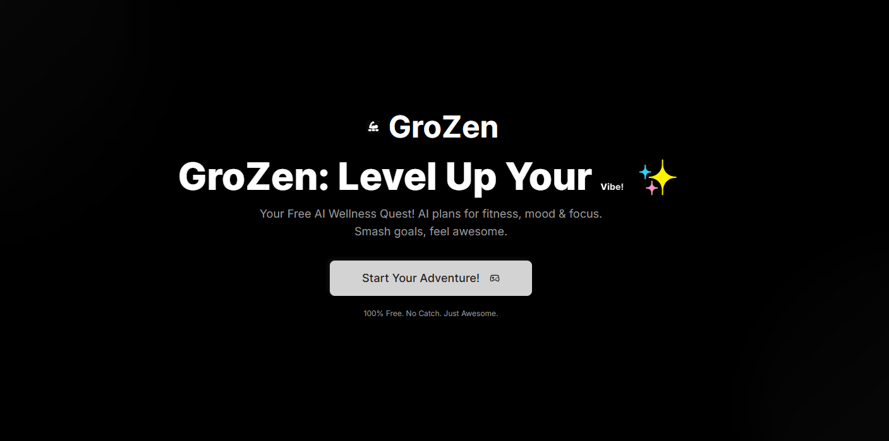

<div align="center">

# GroZen: Level Up Your Vibe!

[](https://opensource.org/licenses/MIT)
[](https://nextjs.org/)
[](https://reactjs.org/)
[](https://firebase.google.com/)
[-4285F4?style=flat&logo=google&logoColor=white)](https://firebase.google.com/docs/genkit)
[](https://tailwindcss.com/)
[](https://www.typescriptlang.org/)

---

### **Free AI Wellness Quest for Teens!**

GroZen is a fun, AI-powered app that helps teens crush health goals with custom diet plans, mood boosts, and epic challenges.  
It’s free, vibrant, and built for teens who want wellness to feel like a game! 🎮

<br>


</div>


---

## 📚 Table of Contents

- [Why GroZen? 🌟](#why-grozen-🌟)
- [What It Does 🥗😊🏆](#what-it-does-🥗😊🏆)
- [Why It’s Perfect for StartWell 🌍](#why-it’s-perfect-for-startwell-🌍)
- [Tech Stack 🛠️](#tech-stack-🛠️)
- [Visuals (Screenshots, Demo Video, Interactive Demo) 📸🎥](#visuals-📸🎥🕹️)
- [Getting Started 🏃](#getting-started-🏃)
- [The Team 👥](#the-team-👥)
- [Documentation 🗎](#documentation-🗎)
- [Future Plans 🔮](#future-plans-🔮)
- [Ethics & Privacy 🔒](#ethics--privacy-🔒)
- [License 📜](#license-📜)
- [Contact 📩](#contact-📩)

---

## Why GroZen? 🌟
As a student, I often have trouble focusing because my attention span is short. I wanted one place to track my mood, thoughts, plans, and productivity instead of using different apps for to-do lists, well-being, and budgeting. This need for simplicity and organization led to the creation of Grozen.

## What It Does 🥗😊🏆
- **Mood Tracking:** You can easily keep track of how you’re feeling and see how your mood changes over time with a simple graph.
- **Task Management:** The app allows you to use everyday language to create to-do lists, making it easy to organize your tasks without any issue.
- **Personalized Plans:** It offers a gamified interactive setup process that leads to customized meal, workout, and mental wellness plans just for you.
- **Fun Competitions:** You can join in on challenges and compete with other users for added motivation.
- **Grocery List Creation:** Based on your meal plans, GroZen can automatically create a grocery list, so you know exactly what to buy.
- **Engaging Experience:** The app is designed to be fun and easy to use, with a clean look and lots of customization options to make it your own.

## Why It’s Perfect for StartWell 🌍
- **AI Innovation**: Uses **Genkit (Google Gemini)** for diet plans, daily schedules, mood feedback, and selfie validation, hitting StartWell’s AI focus.
- **Teen Appeal**: Vibrant, neumorphic UI with gamified “quests” and badges keeps teens engaged.
- **Wellness Impact**: Boosts nutrition, mental health, and habits for teens.
- **User-Friendly**: Simple onboarding and clear visuals make it accessible to all.
- **Scalable**: Built on Firebase for growth; future plans include group challenges and wearables.

## Tech Stack 🛠️
- **Frontend**: Next.js (App Router), React, TypeScript, Tailwind CSS, ShadCN UI (neumorphic dark theme).
- **AI**: Genkit with Google Gemini for plan generation, scheduling, and mood analysis.
- **Backend**: Firebase (Authentication, Firestore, Cloud Functions).
- **Hosting**: Firebase Hosting or Vercel.

## Visuals 📸🎥🕹️
### Screenshots 📸
| Feature | Screenshot |
|---------|------------|
| Landing Page |  |
| Login |  |
| Dashboard |  |
| Leaderboard |  |

### Demo Video 🎥
[Watch our GroZen Demo!](https://youtube.com/your-video)  
*Public, marked “Not for Kids” for COPPA compliance.*

### Interactive Demo 🕹️
[Watch our GroZen Demo!](https://app.supademo.com/demo/cmc4pcj1d0epyllpn4izbui9n)  
*Built with Supademo, interact and use the app in realtime.*

## Getting Started 🏃
1. **Clone the Repo**:
   ```bash
   git clone https://github.com/Techiral/GroZen.git
   cd GroZen
   ```
2. **Install Dependencies**:
   ```bash
   npm install
   ```
3. **Set Up Environment**:
   - Copy `.env.example` to `.env.local`.
   - Add Firebase config and Google API key for Genkit.
4. **Run Locally**:
   ```bash
   npm run dev
   ```
   Visit `http://localhost:9002`.
5. **Test AI (Optional)**:
   ```bash
   npm run genkit:dev
   ```
   Check Genkit UI at `http://localhost:4000`.

## The Team 👥
- **Lakshya Gupta**: Student Developer (Full-Stack, AI Integration)
- **The Techiral Team**: Conceptual Support

## Documentation 🗎
- **Presentation (PPT)**: [Project PPT](docs/grozen-presentation.pptx)
- **One-Pager Summary (Markdown)**: [One Page Summary](docs/one-pager.md)
- **Code Snippets (Markdown)**: [Code Snippets Summ](docs/code-snippets.md)

## Future Plans 🔮
- Expand AI features for deeper insights and personalized suggestions
- Gather user feedback and iterate on design and features
- Launching the mobile app so you can use GroZen anywhere.
- Adding group challenges, chat, and custom avatars to make it more fun with friends.
- Smarter mood tracking that helps you catch stress early.
- Connect with fitness bands and food apps for easier tracking.
- Make tips and daily missions even more personal and helpful.

## Ethics & Privacy 🔒
- **Data Security**: Firebase Firestore stores data securely; selfies are optional and processed only for validation.
- **Ethical AI**: Gemini models are tuned for positive, inclusive feedback, avoiding bias.
- **Transparency**: Users know how their data personalizes their experience.

## License 📜
[MIT License](LICENSE) - explore and contribute!

## Contact 📩
Ping us at Lakshya Gupta on [LinkedIn](https://www.linkedin.com/in/techiral/) or techiralthefuture@gmail.com.

---

*Built with ❤️ for StartWell’s AI Wellness Hackathon!*