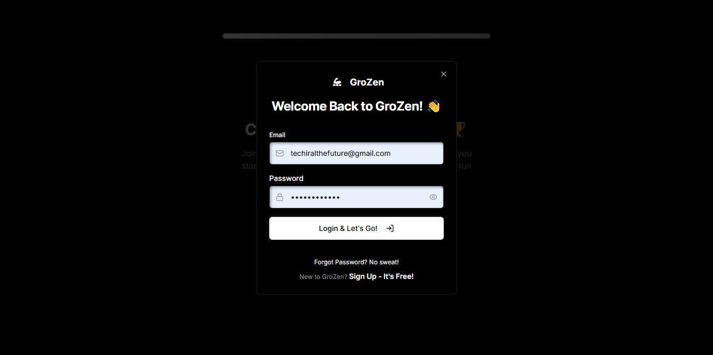
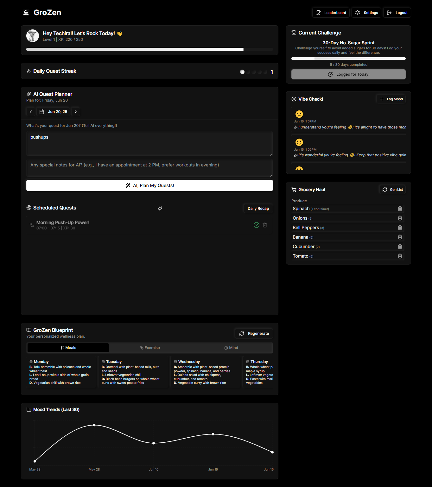

# GroZen: One-Pager 🌟

## Problem 😓
I’m a teen, and life’s crazy- school, friends, and stress make it tough to eat healthy or stay chill. Most wellness apps are boring, confusing, or feel like they’re for adults. They don’t vibe with me or make building habits fun. I need a tool that fits my hectic life and feels like a game, not a chore.

## Solution 🎮
**GroZen** is a free, AI-powered web app that makes teen wellness an epic quest! Powered by **Google Gemini via Genkit**, it offers:
- 🥗 **Custom AI Diet Plans**: Meals tailored to your goals (e.g., “more energy”), preferences (veggie, vegan), and budget.
- 📅 **AI Daily Quests**: Share your day (“homework, soccer, chill”), and AI builds a fun to-do list with XP rewards.
- 😊 **AI Mood Boosts**: Log moods with emojis or selfies; get kind AI tips (e.g., quick breathing exercises) and track vibes.
- 🏆 **Game Vibes**: Earn XP, badges, and climb leaderboards in challenges like “30-Day Hydration Quest.”
- 🛒 **Grocery Lists**: AI-generated for easy, budget-friendly shopping.

## Screenshots 📸
| **Feature** | **Visual** |
|-------------|------------|
| Landing Page |  |
| Login |  |
| Dashboard |  |
| Leaderboard |  |

## User Flow Diagram 🗺️
  
*From landing page to dashboard: sign up, set goals, get AI plans, log moods, and join challenges.*

## Innovation & Originality (25%) 🚀
- **Unique Approach**: GroZen blends **Google Gemini’s** AI with gamification, turning wellness into a teen-friendly adventure unlike generic apps.
- **Fresh Solution**: Gamified quests, leaderboards, and empathetic AI feedback make healthy habits fun and sticky.
- **Trend-Forward**: Uses NLP for task scheduling and image validation for selfies, tapping into AI and digital health trends.

## Wellness Impact & Relevance (30%) 💪
- **Real Need**: Tackles teen stress, poor nutrition, and low motivation with personalized, practical tools.
- **Big Impact**: Boosts nutrition, mental health, and habits for teens, creating a supportive space for individuals and peer communities via challenges.

## Technical Execution (20%) 🛠️
- **Robust Build**: Next.js, TypeScript, and Firebase ensure a stable, scalable prototype.
- **Functional**: Diet plans, quest scheduling, mood tracking, and leaderboards work seamlessly.
- **AI Power**: Gemini drives personalized plans, task parsing, and mood feedback, tightly integrated with Firebase.

## User Experience & Accessibility (15%) 🌈
- **Easy to Use**: Vibrant, neumorphic UI with simple onboarding (email, selfie) is teen-friendly.
- **Accessible**: High-contrast visuals, clear fonts, and optional selfies support diverse users.
- **Empathetic**: Kind AI feedback and gamified design make wellness feel supportive and fun.

## Scalability & Sustainability (10%) 📈
- **Growth Ready**: Firebase scales for more users; future group challenges and wearables expand reach.
- **Ethical Design**: Secure data storage, optional selfies, and bias-free AI ensure trust and long-term use.

## Tech Stack 🔧
- **Frontend**: Next.js, React, TypeScript, Tailwind CSS, ShadCN UI.
- **AI**: Genkit with Google Gemini.
- **Backend**: Firebase (Authentication, Firestore, Cloud Functions).
- **Hosting**: Firebase Hosting or Vercel.

## Team 👥
- **Lakshya Gupta**: Student Developer (Full-Stack, AI)
- **The Techiral Team**: Concept Support

## Why GroZen Wins StartWell 🏆
GroZen’s AI-driven, gamified wellness app empowers teens to conquer stress and build habits in a fun, judgment-free space. With cutting-edge tech and a scalable vision, it’s ready to transform teen health for StartWell!

*Built with ❤️ for StartWell’s AI Wellness Hackathon, June 20, 2025*